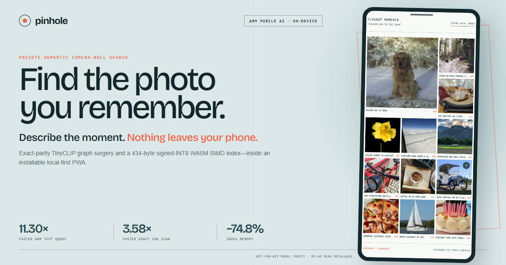

# Pinhole

**Describe the moment. Find the photo. Nothing leaves your phone.**

[](https://github.com/TAUIL-Abd-Elilah/pinhole-ai/actions/workflows/ci.yml)
[](LICENSE)
[](https://arm-ai-optimization-challenge.devpost.com/)

Pinhole is an installable, local-first camera-roll search engine for Arm-powered
Android devices. Type a memory such as _“golden dog in the snow”_; a 24 MB INT8
TinyCLIP model embeds the query on-device, and a 434-byte WebAssembly SIMD kernel
searches compact photo embeddings. Photograph bytes are never sent to an API.

Built for the **Arm Create: AI Optimization Challenge 2026 — Mobile AI track**.



## Judge it in 90 seconds

**[Open the live PWA](https://tauil-abd-elilah.github.io/pinhole-ai/)**, choose
**Load demo roll**, and search for `golden dog in the snow`. The complete path
runs in the browser; no backend or API key is involved.

On the first production visit, the page reloads once to install cross-origin
isolation; the status pill then reports the live WASM thread count. The first
uncached query includes tokenizer/session warm-up, so use a second **different**
phrase to observe the steady-state path. Repeating the same phrase deliberately
reports `cached` instead of presenting cache reuse as encoder speed.

Then inspect the [final raw Arm evidence](bench/results/cobalt-31625513958/)
or run the complete local quality gate with one command:

```bash
npm ci
npm run verify
```

The native Arm64 browser proof, exact model hashes, benchmark methodology, and
quality guards are linked directly below; no account or special hardware is
needed to evaluate the hosted product.

The latest [public Arm64 quality run](https://github.com/TAUIL-Abd-Elilah/pinhole-ai/actions/runs/31648817286)
also proves the headerless static-host isolation path, exact query-cache reuse,
and a forced-offline reload/search—not only a development-server happy path. Its
native-Arm recorder then disables browser networking, confirms an uncached probe
is blocked, waits for the product's **Offline · local search active** status,
searches a second phrase, and asserts the correct result.


The deployed experience is measured too: a dated Lighthouse 12.8.2 mobile
snapshot scored **97 Performance and 100 Accessibility / Best Practices / SEO**,
and the full ranked-result flow passed its dynamic WCAG 2 A/AA gate. See the
[reproducible UX audit](docs/UX_AUDIT.md) and its
[committed raw Lighthouse report](bench/results/lighthouse-20260812.json).

## Run it locally

To run it locally:

```bash
git clone https://github.com/TAUIL-Abd-Elilah/pinhole-ai.git
cd pinhole-ai
npm ci
npm run dev
```

Open the printed URL, choose **Load demo roll**, then search for:

- `golden dog in the snow`
- `coffee on an open book`
- `yellow flower on black`
- `a sailboat on the water`

Or choose your own image files. Pinhole stores only a small WebP thumbnail and a
516-byte compact vector (512 signed bytes plus one Float32 scale) in the
browser's IndexedDB. It neither uploads nor retains the original file.

## What was optimized

Pinhole is not merely a web app that happens to run on Arm. It changes the model
graph, data representation, and execution path for the constraints of a phone.

| Layer | Stock path | Pinhole path | Why it matters |
|---|---|---|---|
| Query model | Combined CLIP text + vision graph; a normal forward requires both inputs | Extracted text-only graph, exact output parity | A text search does not execute the 10-layer vision transformer |
| Photo model | Same 24.28 MB combined graph | Independent 8.96 MB vision graph, loaded only when photos are imported | Existing indexes become searchable without loading camera inference |
| Model precision | 94.07 MB FP32 graph | 24.28 MB upstream INT8 weights | 74.2% smaller model payload |
| Search index | 512 Float32 values per photo (2,048 bytes) | 512 INT8 values + one Float32 scale (516 bytes) | 74.8% less index memory |
| Similarity scan | Scalar JavaScript Float32 loop | Signed INT8 WebAssembly SIMD batches, mapping to Neon on Arm | Higher throughput with deterministic scalar fallback |
| Re-indexing | Recompute every selected file | Stable metadata fingerprint + IndexedDB cache | Unchanged photos are skipped |
| Static-host threading | GitHub Pages cannot emit COOP/COEP headers | Isolation service worker plus one-time install reload | SharedArrayBuffer unlocks up to four ONNX Runtime WASM threads; unsupported browsers retain the one-thread path |

The graph split is not an approximation. `tools/prepare_model.py` pins the source
revision and SHA-256, extracts the two independent ONNX subgraphs, and verifies
**bit-for-bit equality** for text and image embeddings. Generated artifact hashes
live in [`pinhole-manifest.json`](public/models/pinhole-tinyclip/pinhole-manifest.json).

## Measured on Arm

The final evidence run executed the shipped ONNX Runtime Web/WASM SIMD path in
native Arm64 Chromium on a real 4-core **Arm Neoverse-N2 (Microsoft Cobalt
100)** runner. It interleaved 30 samples of each path after 7 warm-ups so
temperature and scheduling could not systematically favor one path. Even when
the combined graph requested only `text_embeds`—the strongest unsplit
control—the exact split was **9.76x faster**:

| Product-runtime measurement | Strongest baseline | Pinhole | Result | Quality guard |
|---|---:|---:|---:|---|
| Browser text query, 2 WASM threads | combined graph, text output only: 121.86 ms | split text graph: 12.49 ms | **9.76x faster** | bit-for-bit equal |

Why the combined graph is the fair baseline: upstream publishes **no** split
artifact for this model—only eight variants of one combined graph—so a developer
adopting it starts exactly where this measurement starts. The
`combined_requested_text_only` control settles the obvious objection: asking the
unsplit session for only `text_embeds` costs 121.86 ms against the full forward's
121.85 ms, so ONNX Runtime does not prune the unused vision branch on its own.
The work had to be removed deliberately.

The raw result records `host.architecture: arm64`, Chromium's high-entropy
client hint `architecture: arm`, the exact model hashes, every dispersion
statistic, and the workflow identity in run
[`31625513958`](https://github.com/TAUIL-Abd-Elilah/pinhole-ai/actions/runs/31625513958).

The same Arm run isolates the custom SIMD kernel from vector compaction by
scanning the **identical signed-INT8 corpus** through both paths:

| Arm64 vector measurement | Scalar JavaScript | WASM SIMD | Result | Correctness guard |
|---|---:|---:|---:|---|
| Dot-product scan only | 6.735 ms | 0.436 ms | **15.44x faster** | every integer score equal |
| Scan + rescale + full Top-K sort | 9.649 ms | 3.410 ms | **2.83x faster** | identical Top-K |

These medians cover 25 rotating-order queries after 3 warm-ups. They prove the
SIMD contribution independently; the Float32-to-compact comparison below remains
the end-product measure of memory reduction and retrieval quality together.

The final run also provides one internally consistent native CPU and
compact-index comparison on the same Cobalt hardware. These are medians, not
best runs:

| Optimization | Arm baseline | Pinhole | Result | Quality guard |
|---|---:|---:|---:|---|
| Text query, 1 thread | combined graph 45.55 ms | split text graph 3.97 ms | **11.47x faster** | bit-for-bit equal |
| Text query, 4 threads | combined graph 15.41 ms | split text graph 1.70 ms | **9.05x faster** | bit-for-bit equal |
| 10k-vector full ranking | Float32 JS 9.531 ms | INT8 WASM SIMD 3.410 ms | **2.80x faster** | 99.6% mean Recall@10; 100% Top-1 agreement |
| 10k-vector index | 20.48 MB | 5.16 MB | **74.8% smaller** | same quality run |
| 12-photo demo retrieval | Float32 12/12 Top-1 | compact INT8 12/12 Top-1 | **100% agreement** | fixed, disclosed queries |

The raw JSON retains all 50 native model samples / 30 browser model samples / 25
search queries, p95, min/max, MAD, exact model hashes, environment, and Actions
identity. See the [`final browser and quality evidence`](bench/results/cobalt-31625513958/)
and the [methodology](bench/README.md). Three earlier runs remain committed as
repeatability evidence; their pre-control 3.49-3.58x Float32 comparisons are not
used as the final headline.

Both model harnesses deliberately measure a full **77-token** sequence, CLIP's
maximum. The shipped tokenizer uses the model's dynamic sequence axis and sends
only the actual query length, so the quoted encoder latency is a conservative
upper bound rather than a typical short-query claim.

This is not only a native harness. Run
[`31625513958`](https://github.com/TAUIL-Abd-Elilah/pinhole-ai/actions/runs/31625513958)
installed Arm64 Chromium on Cobalt, built the production PWA, loaded and embedded
all 12 photographs at a 390×844 mobile viewport, and ranked the dog first with
two WASM threads and zero console/request errors. The flow explicitly asserted
the `wasm simd` search path and ran a dynamic WCAG 2 A/AA audit after the ranked
grid settled. Its captured Arm frame appears in the cover image above; timings
shown in that product flow are live telemetry, not benchmark claims.

Four benchmark harnesses reproduce the claims:

```bash
# Exact-parity combined graph vs split graphs
python -m venv .venv
. .venv/bin/activate
pip install -r requirements-dev.txt
python tools/benchmark_model.py --samples 50 --warmup 7

# Same strongest control in ONNX Runtime Web/WASM SIMD
# (requires the pinned baseline, Chrome, and a running dev server)
npm run benchmark:browser-model

# Float32 scalar index vs INT8 WebAssembly SIMD index
npm run build:wasm
npm run benchmark:index

# End-task quality on the attributed demonstration roll
node tools/benchmark-retrieval.mjs
```

The model harness includes a strong control: it requests only `text_embeds` from
the unsplit raw ONNX session. ONNX Runtime still scheduled the combined graph on
Arm (45.72 ms at one thread), while Pinhole's extracted text graph took 4.04 ms.
That rules out the misleading comparison where a baseline needlessly fetches
outputs that the runtime could otherwise prune.

See [optimization details](docs/OPTIMIZATION.md) for the graph surgery, compact
embedding format, SIMD design, and measurement policy.

## Architecture

```text
selected photo (browser File; memory only)
       │
       ├─ TinyCLIP vision INT8 / ONNX Runtime Web / WASM SIMD
       │       └─ normalized 512-D embedding
       │                └─ symmetric INT8 (512 B + scale)
       │
       └─ resized WebP thumbnail
                └──────────────┐
                               ▼
                        local IndexedDB
                               │
query ─ CLIP tokenizer ─ text-only INT8 graph
                               │
                               ▼
                 434 B WASM SIMD dot-product kernel
                               │
                               ▼
                       ranked local contact sheet

network boundary: app/model download only; photos and inference stay in browser
```

The inference worker keeps model work off the UI thread. Cross-origin-isolated
deployments use up to four WASM threads; other hosts retain SIMD with one thread.
That threading win follows directly from the privacy design: the application,
models, runtime, WASM, fonts, and demo media are same-origin assets, so strict
COEP does not break a third-party dependency or widen the network boundary.
The custom vector kernel has a scalar TypeScript fallback and signed-INT8 parity
tests, including non-multiple-of-16 tails. The index harness also times an
equivalent signed-INT8 scalar control against the WASM batch kernel on the
identical quantized corpus, so the SIMD contribution is separable from the 74.8%
storage reduction.

## Reuse the pattern

Pinhole's useful output is not limited to this interface. The extracted
exact-parity encoders, compact-vector format, single-call SIMD scan, benchmark
schemas, and quality gates are all inspectable artifacts. The
[porting guide](docs/PORTING.md) maps each piece to its source file and gives a
step-by-step recipe for adapting the hot-path/cold-path split to another
multimodal retrieval application.

## Validate the claims

```bash
npm ci
npm run verify        # lint + unit tests + TypeScript + production PWA
node tools/browser-smoke.mjs  # needs local Chrome and a running dev server
node tools/browser-flow.mjs   # model load → 12-photo index → semantic search
node tools/browser-offline.mjs # cache → force network offline → reload → search

# Optional deterministic delivery profile: 4 Mbps down / 3 Mbps up / 50 ms
PINHOLE_NETWORK_PROFILE=fast-4g PINHOLE_REPORT=.cache/flow.json \
  node tools/browser-flow.mjs
```

The full browser flow asserts that `golden dog in the snow` ranks the dog first,
confirms the WASM SIMD path, records cold-flow milestones and every ONNX/WASM
response, injects axe-core after the ranked grid settles, fails on any WCAG 2
A/AA violation or console/request error, and saves the same screen shown above.
It also fails if the heavier Asyncify runtime is requested instead of Pinhole's
pinned plain threaded runtime. The offline flow first proves an uncached request
is blocked, then reloads the service-worker-controlled live PWA and finds a
second photo from the persisted local index.

A fresh-profile audit of the live full-demo path observed **19,893,682 bytes
(19.0 MiB)** of gzip-encoded inference-artifact responses: the two split ONNX
models, ORT loader/runtime, and custom kernel. The requested ORT WASM response was
3,352,806 bytes; the unused 23.57 MB Asyncify dependency artifact was never
requested. These are HTTP `Content-Length` values—not cache footprint or a
latency benchmark—and the [raw browser report](docs/evidence/live-browser-payload-20260812.json)
records the exact URLs and encodings.

## Privacy boundary

- No analytics, account, API key, ad SDK, or inference endpoint.
- Full photographs exist only in the user's file handle and transient worker
  memory while being embedded.
- IndexedDB contains the derived INT8 vector and a resized thumbnail—not the
  original photo.
- Clearing the local index deletes both derivatives.
- The model and ONNX runtime are same-origin static assets. Once cached, the app
  can be installed and used offline.

With the 12-photo public roll loaded, the interface shows **1.3 MB not sent to
an AI API**. After static assets are cached, each query sends zero user-content
bytes and incurs no cloud-inference round trip.

This is a technical privacy boundary, not a promise in marketing copy. See
[`docs/PRIVACY.md`](docs/PRIVACY.md) for the threat model and limitations.

## Repository map

```text
src/workers/            split TinyCLIP inference worker
src/lib/                quantization, SIMD index, IndexedDB, client
wasm/dot_i8.wat         auditable signed-INT8 SIMD kernel
public/models/          pinned exact-parity split ONNX artifacts
public/demo/            attributed open-license demonstration roll
tools/                  model build, benchmarks, browser validation
bench/                  methodology and committed Arm evidence
docs/                   optimization, privacy, decisions, submission assets
```

## Limits

- TinyCLIP is intentionally small; unusual or highly specific memories can rank
  imperfectly. Pinhole exposes scores instead of pretending certainty.
- Browser storage can be cleared by the OS or user. This prototype does not yet
  restore access to original files after a restart; it displays stored thumbnails.
- The current scan is exact O(n), optimized for camera rolls up to tens of
  thousands of photos. An approximate index would help at larger scales.
- Power is not estimated from wall time. Energy claims require an external power
  meter and are intentionally absent.

## Licensing

Pinhole source code is [MIT licensed](LICENSE). TinyCLIP and runtime attribution is
in [THIRD_PARTY_NOTICES.md](THIRD_PARTY_NOTICES.md). The demo photographs retain
their individual CC0/Creative Commons licenses and complete attribution in
[`public/demo/ATTRIBUTION.md`](public/demo/ATTRIBUTION.md).
